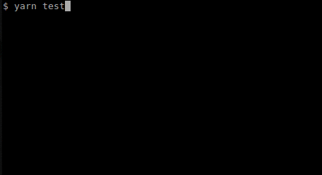

# Testing Ionic2 with Jest

[](https://travis-ci.org/datencia/ionic2-jest-example)
[](https://codecov.io/gh/datencia/ionic2-jest-example)


This is an example of how to test an [Ionic 2](https://ionicframework.com/) app using [Jest](https://facebook.github.io/jest/).



[Ionic 2](https://ionicframework.com/) is a great framework for building amazing mobile apps with
[Angular](https://angular.io/), but as you may know, it comes without support for unit tests.
Yes, that's even if it seems incredible in the 21st century :-(

Of course, there are different approaches to have unit tests working with an Ionic 2 Project, but most
of then require too much configuration and knowledge about the related tooling (jasmine, karma, ...).

[Jest](https://facebook.github.io/jest/) is a complete and easy to set-up JavaScript testing solution
created by Facebook. Some of its benefits are:

- Fast and sandboxed
- Built-in code coverage reports
- Zero configuration

This project tries to illustrate how to add support for unit tests to an Ionic 2 project with a minimal
configuration. It's based on the awesome article [Testing Angular faster with Jest](https://www.xfive.co/blog/testing-angular-faster-jest/)
by [Michal Pierzchala](https://www.xfive.co/blog/author/michal/).

## Summary

- Prerequisites
- Steps to run the example
- Steps to add Jest to your own Ionic 2 project

### Prerequisites

You’ll need to install the latest version of the Ionic CLI and Cordova. Before you do that,
you’ll need a recent version of Node.js. [Download the installer](https://nodejs.org/en/) for
Node.js 6 or greater and then proceed to install the Ionic CLI and Cordova for native app development:

> Verify that you are running at least node v6.x.x and npm 3.x.x by running `node -v` and `npm -v`
in a terminal / console window. Older versions may produce errors.

### Steps to run then example

- Install the latest version of the Ionic CLI and Cordova.
```bash
$ npm install -g cordova ionic
```

 > You may need to add “sudo” in front of these commands to install the utilities globally

 > If you run `ionic -v` it should return 3.0.0 (or greater)

- Clone this repo into a new project folder.
 ```bash
 $ git clone https://github.com/datencia/ionic2-jest-example.git
 $ cd ionic2-jest-example
 ```

- Run `npm test` (or `yarn test` if you have [yarn](https://yarnpkg.com/) installed) to run the tests.

- You can also run the command `ionic serve` to get a quick preview of the app in the browser.

### Steps to add Jest to your own Ionic 2 project

- Install Jest dependencies:
```bash
$ npm install jest jest-preset-angular @types/jest --save-dev
```

- Add this to your npm scripts:
```json
"test": "jest",
"test:watch": "jest --watch",
"test:ci": "jest --runInBand",
```

 Learn more about [Jest CLI Options](https://facebook.github.io/jest/docs/en/cli.html)

- Include this in your `package.json`:
```json
{
  "jest": {
    "preset": "jest-preset-angular",
    "setupTestFrameworkScriptFile": "<rootDir>/src/setupJest.ts",
    "transformIgnorePatterns": [
      "node_modules/(?!@ngrx|@ionic-native|@ionic)"
    ]
  }
}
```

- In the `src` folder create a `setupJest.ts` file with following contents:
```javascript
import 'jest-preset-angular';
import './jestGlobalMocks'; // browser mocks globally available for every test
```

- Then create the `jestGlobalMocks.ts` file with following contents
```javascript
const mock = () => {
  let storage = {};
  return {
    getItem: key => key in storage ? storage[key] : null,
    setItem: (key, value) => storage[key] = value || '',
    removeItem: key => delete storage[key],
    clear: () => storage = {},
  };
};

Object.defineProperty(window, 'localStorage', {value: mock()});
Object.defineProperty(window, 'sessionStorage', {value: mock()});
Object.defineProperty(window, 'getComputedStyle', {
  value: () => ['-webkit-appearance']
});
```

- In the `src` folder create a `tsconfig.spec.json` file with following contents:
```json
{
  "extends": "../tsconfig.json",
  "compilerOptions": {
    "outDir": "../out-tsc/spec",
    "module": "commonjs",
    "target": "es5",
    "allowJs": true
  },
  "include": [
    "**/*.spec.ts"
  ]
}
```
